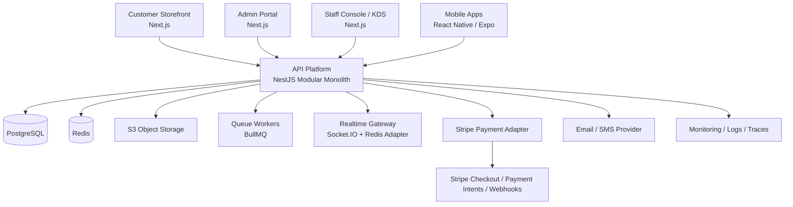

# Tuckinn Proper Production Architecture

## Objective

Replace the current single-file prototype backend with a production-ready commerce platform that supports:

- customer storefront ordering
- staff kitchen and fulfillment operations
- admin catalog and promotion management
- secure customer and staff identity
- payment gateway integration
- launch-safe observability, backups, and deployment

Inference: this is a single-brand commerce platform for Tuckinn Proper, not a multi-merchant SaaS. If that changes, tenant isolation and billing become first-class architecture concerns.

## Current State Summary

The current system is useful as a UX and workflow prototype, but not as the launch backend:

- frontend is a static Alpine app
- backend is one Express file
- persistence is `sql.js` plus a local SQLite file
- sessions are in-process
- staff auth is PIN-based
- menu data is stored as JSON blobs
- there is no payment lifecycle
- there are no migrations, queues, audit logs, or deployment boundaries

## Target System

## Recommended Stack

### User-facing applications

- `apps/storefront`: Next.js App Router, TypeScript, Tailwind
- `apps/admin`: Next.js App Router, TypeScript, Tailwind
- `apps/staff`: Next.js App Router, TypeScript, Tailwind
- `apps/mobile`: React Native with Expo

### Platform services

- `apps/api`: NestJS
- `packages/ui`: shared design system
- `packages/types`: shared contracts and DTO types
- `packages/config`: ESLint, TypeScript, env validation, API client config

### Data and infrastructure

- PostgreSQL for transactional data
- Redis for cache, queues, rate limiting, sessions, idempotency keys
- S3 for media and generated assets
- BullMQ for async jobs
- Socket.IO with Redis adapter for live staff updates
- Docker for local and CI environments
- GitHub Actions for CI/CD
- AWS recommended for initial deployment

## Why A Modular Monolith First

Start with a modular monolith, not microservices.

Why:

- it ships faster
- it is much easier to test and operate
- data relationships are still dense and transaction-heavy
- the team can keep one deployment unit while still enforcing domain boundaries

Trade-off:

- less horizontal independence than microservices
- much lower operational overhead at this stage

Microservices only make sense later if specific domains outgrow the monolith, such as notifications, analytics, or catalog sync.

## Backend Domain Modules

The API should be built as separate NestJS modules with explicit ownership:

- `auth`
- `users`
- `rbac`
- `customers`
- `catalog`
- `modifiers`
- `pricing`
- `promotions`
- `tables`
- `carts`
- `checkout`
- `payments`
- `orders`
- `fulfillment`
- `notifications`
- `content`
- `media`
- `analytics`
- `audit`
- `webhooks`

## Launch-Safe Payment Design

### Recommendation

Use Stripe first.

Why:

- fastest correct path to web checkout
- strong support for cards, Apple Pay, and Google Pay
- well-defined webhook lifecycle
- mature refund and reconciliation support

Adyen is the stronger enterprise choice if you later need broader acquiring strategy or more complex omnichannel payment routing. For launch, Stripe is the pragmatic choice.

### Required payment flow

1. Client creates a checkout session or payment intent through the API.
2. API computes totals from trusted catalog data, not client-submitted totals.
3. Payment provider handles confirmation.
4. Webhook confirms the final payment state.
5. Order transitions from `pending_payment` to `paid`.
6. Staff/KDS sees only payable or paid orders based on the chosen flow.

### Minimum payment states

- `pending_payment`
- `requires_action`
- `authorized`
- `paid`
- `failed`
- `cancelled`
- `refunded`
- `partially_refunded`

## Security Baseline

- JWT access tokens plus refresh token rotation for customer auth
- RBAC for staff and admin access
- hashed passwords with reset flow
- encrypted secrets and managed secret storage
- row-level audit logging for admin mutations
- webhook signature verification
- request validation on every write endpoint
- idempotency keys for checkout and payment writes
- Redis-backed rate limiting
- CSP and hardened headers
- no static serving from backend root

## Realtime And Operations

The staff console should move from polling plus local Socket.IO to a proper realtime workflow:

- API emits order and fulfillment events
- Socket gateway broadcasts through Redis adapter
- workers handle notification side effects
- dashboard metrics come from database queries or materialized reporting tables

## Environments

### Local

- Docker Compose for Postgres, Redis, Mailpit, API, and web apps

### Staging

- full production-like environment
- test payment mode
- webhook replay support

### Production

- managed Postgres
- managed Redis
- S3
- CDN
- central logs and metrics
- daily backups plus restore drill

## Phase 1 Deliverables

This document defines the target architecture. The next implementation documents in this phase are:

- target monorepo structure
- PostgreSQL schema draft

## Immediate Next Build Module

After approval, build the foundation in this order:

1. monorepo scaffold
2. API module skeleton
3. PostgreSQL schema via Prisma
4. auth and RBAC
5. catalog admin backend
6. payments and checkout
