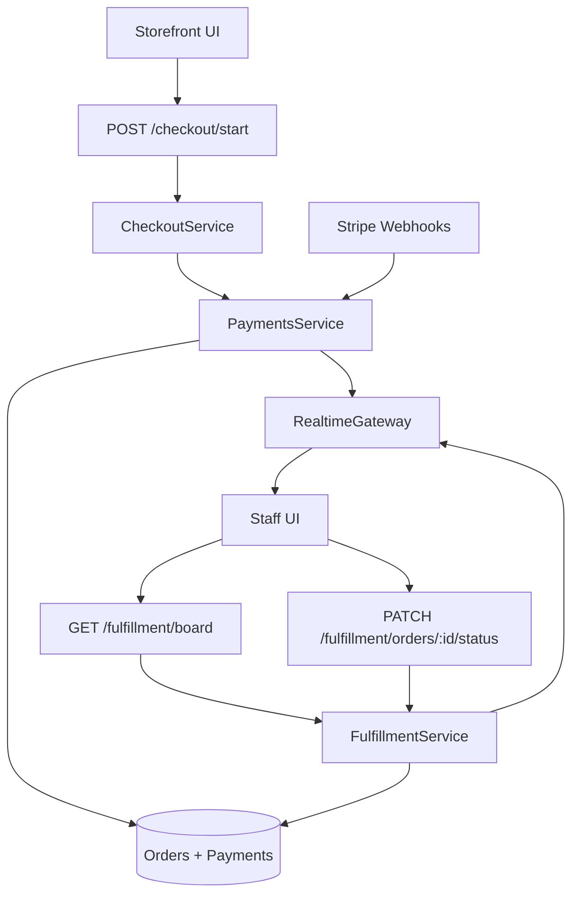

# Staff Orders Operations Design

**Date:** 2026-04-09  
**Scope:** `platform/apps/staff` plus the order/realtime path in `platform/apps/api`

## Goal

Upgrade the staff panel into a stronger live order operations board and verify that it receives storefront orders in real time through the existing checkout, payments, fulfillment, and Socket.IO flow.

## Current State

The platform already has the main pieces in place:

- Storefront creates orders through `POST /api/checkout/start`
- Payment success sets the order to `paid`
- The API emits `order:updated` and `board:refresh`
- The staff app listens with Socket.IO and reads `GET /api/fulfillment/board`
- Staff can move orders with `PATCH /api/fulfillment/orders/:orderId/status`

This means the project does **not** need a brand-new integration. It needs:

1. a staff workflow/UX upgrade
2. end-to-end realtime hardening and verification

## Architecture Summary

## Approved Direction

- Keep the existing order model and fulfillment lifecycle:
  - `paid`
  - `accepted`
  - `preparing`
  - `ready`
  - `completed`
  - `cancelled`
- Rebuild the staff board around actual operations needs:
  - easier scanning
  - clearer urgency
  - more obvious status movement
  - better visibility into reconnect/live state
- Carry the Tuckinn Proper brand system into staff in a calmer operations-focused presentation, similar to the admin app rather than the storefront.
- Add verification around the realtime chain so the team can trust that paid storefront orders appear on the staff board.

## Staff UX Design

### Login + Shell

- Rebrand the staff app with the same Tuckinn Proper logo, fonts, and palette used in storefront/admin.
- Keep the shell calmer and utility-first:
  - cream background
  - espresso text
  - deep red primary
  - restrained gold for emphasis

### Order Board

- Replace the generic single-card board feel with clearer operational grouping.
- Recommended grouping:
  - new paid/awaiting acceptance
  - in progress
  - ready for handoff
  - completed/cancelled/history via filters
- Surface the most important staff questions first:
  - what is newest?
  - what is urgent?
  - what needs action now?
  - what can be completed next?

### Card Content

- Make order cards easier to scan:
  - stronger order number
  - customer and order kind secondary
  - clearer item stack
  - special instructions visually distinct
  - total and status visible at a glance
- Add simple urgency/recency cues using order age and status age.

### Actions

- Keep the current status transition rules.
- Make next actions clearer and faster to use:
  - primary action for the most likely next step
  - secondary/danger treatment for cancellation or less common actions
- Preserve optional staff notes on transitions.

### Live State

- Make realtime state explicit:
  - connected
  - reconnecting
  - last refresh signal
- Empty states should distinguish between:
  - genuinely no orders
  - disconnected/reconnecting
  - filtered-out orders

## Backend Hardening

### Realtime

- Verify that payment success from both mock payments and Stripe webhook paths emits:
  - `order:updated`
  - `board:refresh`
- Verify that fulfillment status changes also emit both events.
- Ensure the emitted payloads are sufficient for staff refresh behavior and diagnostics.

### Board Payload

- Keep the existing board endpoint, but upgrade the response if needed for the staff UI:
  - order timing fields
  - summarized status counts
  - stable sort for operational relevance
- Any payload additions must remain additive so existing callers are not broken.

## Testing and Verification

- API tests:
  - paid storefront order appears in active board scope
  - fulfillment status changes update board membership correctly
  - realtime emission paths fire for payments and fulfillment transitions
- Staff UI verification:
  - build passes
  - reconnect state renders
  - empty/filtered/active views render
- End-to-end verification:
  - a storefront checkout that reaches `paid` becomes visible in staff without manual page reload

## Best Skills

- `architecture-designer`: end-to-end order event path and failure modes
- `ui-ux-pro-max`: staff board layout and visual hierarchy
- `nextjs-developer`, `react-expert`: staff app implementation
- `nestjs-expert`: fulfillment/realtime integration hardening
- `test-master`, `playwright-expert`: verification and E2E coverage
- `monitoring-expert`: observability for the order event chain
- `code-reviewer`, `verification-before-completion`: final quality gate

## Recommended Agents

- Main agent: coordination and integration
- Explorer: trace storefront → payment → fulfillment → realtime flow
- Worker 1: staff UI/UX and branding
- Worker 2: API fulfillment/realtime hardening
- Worker 3: tests and end-to-end verification
