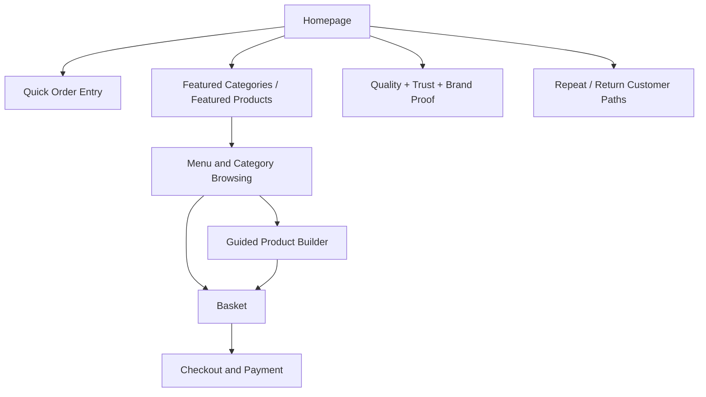

# Tuckinn Storefront Premium Conversion Upgrade Design

## Goal

Upgrade the public Tuckinn storefront into a premium-feeling, high-conversion ordering experience that drives more online orders while keeping the brand perception strong enough to feel like a serious premium local food business.

## Scope

This spec is for the public storefront only.

It does not include:

- admin workflow redesign
- staff workflow redesign
- API redesign
- mobile app redesign

Those systems can support the storefront, but they are not part of this upgrade spec.

## Commercial Objective

The storefront must optimize for two business outcomes at the same time:

1. More online orders from local customers who want a fast lunch or takeaway experience
2. Stronger premium brand perception so the business looks more valuable, more trustworthy, and more desirable

The site should not choose between speed and premium. It should feel premium while being fast to order from.

## Audience

The storefront needs to convert two overlapping customer modes:

### 1. Fast-order local customers

People who want:

- a quick lunch decision
- clear menu options
- minimal friction
- mobile-friendly ordering
- confidence that the order process is simple

### 2. Higher-spend premium customers

People who respond to:

- better presentation
- stronger quality cues
- better brand trust
- richer product storytelling
- more confidence in the business and its food standards

The design must serve both without splitting the experience into two separate websites.

## Constraints

- Use the assets and brand work already available
- Do not assume a new photo or video shoot
- Build on the current Next.js storefront instead of replacing the stack
- Preserve the working catalog, basket, and checkout flow
- Focus first on the storefront path from homepage to basket to payment

## Design Principle

The target is not “fancy”.

The target is:

- premium enough to raise perceived value
- simple enough to order from quickly
- polished enough to feel intentional
- structured enough to increase conversion and average order value

This means the site should feel like a premium deli brand with a high-functioning ordering engine underneath it.

## Best Skills For The Work

### Primary skills

- `ui-ux-pro-max`
  - premium design direction
  - merchandising structure
  - conversion-oriented layout decisions
  - anti-pattern avoidance
- `architecture-designer`
  - storefront information architecture
  - homepage-to-menu-to-basket funnel structure
  - system-level page and component boundaries
- `nextjs-developer`
  - App Router structure
  - metadata and SEO
  - performance-aware page composition
- `react-expert`
  - ordering interactions
  - guided builder behavior
  - cart and upsell experience quality
- `typescript-pro`
  - safer storefront types
  - stronger UI-state modeling

### Validation and release skills

- `playwright-expert`
  - ordering-flow regression coverage
  - conversion journey verification
- `code-reviewer`
  - correctness and maintainability review
- `verification-before-completion`
  - real proof before release claims

### Secondary support skills

- `visual-forge`
  - asset cleanup and enhancement using existing material
- `monitoring-expert`
  - funnel instrumentation and error visibility after launch

## Recommended Upgrade Strategy

### Recommended approach

Use a conversion-led premium storefront refresh.

This is the correct approach because:

- the storefront already works
- the checkout path is already connected
- a premium brand layer has already started
- the biggest remaining opportunity is conversion quality, not system replacement

### Rejected alternatives

#### 1. Visual refresh only

Rejected because it would improve appearance without improving the ordering funnel enough.

#### 2. Full flagship rebuild from scratch

Rejected for now because it adds too much scope before the current storefront has been pushed to its real commercial ceiling.

## Current Storefront Weaknesses

Based on the current code and project direction, the public storefront still has these commercial limitations:

1. The homepage is still too close to an app shell and not strong enough as a premium sales surface.
2. Menu discovery is functional but not merchandised aggressively enough.
3. Product desire is underdeveloped because the site relies too much on structure and not enough on appetite-building presentation.
4. The builder flow works, but it does not yet feel guided enough for fast decision-making.
5. The basket experience can do more to increase order confidence and average order value.
6. Mobile ordering likely works, but it does not yet feel deliberately optimized as the primary commercial surface.
7. Trust-building content exists only lightly compared to what a premium local brand needs.
8. The storefront does not yet appear instrumented as a serious optimization surface.

## Target Storefront Experience

The upgraded storefront should feel like this:

- immediate premium brand recognition
- obvious “start ordering now” entry point
- clear fast path for ready-made products
- clear guided path for custom orders
- stronger product and meal-deal merchandising
- smoother mobile-first browsing
- a basket that reassures and upsells
- a checkout that feels confident and polished

The experience should communicate:

- quality
- speed
- local credibility
- ease
- confidence

## Storefront Architecture

## Upgrade Pillars

### 1. Brand and Trust Layer

Purpose:

- increase perceived value
- make the business look more established
- make customers comfortable ordering

Upgrades:

- stronger homepage hero
- clearer brand positioning
- more professional trust sections
- better explanation of product quality, speed, and ordering convenience
- more expensive-feeling layout rhythm and hierarchy

Success criteria:

- the homepage looks credible and premium within seconds
- users understand what Tuckinn is and why they should order

### 2. Menu Merchandising Layer

Purpose:

- turn menu browsing into a sales surface
- improve discoverability and appetite appeal

Upgrades:

- stronger featured sections
- better meal-deal emphasis
- better differentiation between quick-pick items and custom-build items
- stronger category narratives
- more intentional ordering of products and sections

Success criteria:

- users can decide quickly
- higher-margin and high-conversion items are surfaced better

### 3. Guided Ordering Layer

Purpose:

- reduce friction
- reduce choice overload
- speed up custom ordering

Upgrades:

- better builder progression
- clearer option grouping
- stronger defaults
- more visible selection summaries
- less “form” feeling, more guided flow feeling

Success criteria:

- custom-order flows feel fast instead of heavy
- users are less likely to abandon before basket

### 4. Conversion Optimization Layer

Purpose:

- increase completed orders
- improve basket size

Upgrades:

- smarter add-on prompts
- cross-sell logic in basket
- better CTA hierarchy
- stronger reassurance around collection/payment
- reduced dead-end states
- clearer urgency and convenience messaging where appropriate

Success criteria:

- higher basket completion
- better average order value

### 5. Performance and Proof Layer

Purpose:

- make the premium feel believable
- prevent polish from being undermined by friction

Upgrades:

- better loading states
- tighter transitions and interaction polish
- stronger SEO and metadata strategy
- funnel instrumentation points
- regression tests around primary conversion paths

Success criteria:

- storefront feels fast and stable
- future optimization can be based on evidence

## High-Value Upgrade List

These are the top-value upgrades that should drive the roadmap:

1. Rebuild the homepage into a premium conversion landing page.
2. Create clearer dual entry points for “order fast” and “build your own”.
3. Improve menu merchandising so featured and high-value items are easier to choose.
4. Redesign the builder flow as a guided experience.
5. Upgrade the basket into a better conversion surface with smarter upsells.
6. Improve mobile-first navigation and sticky ordering actions.
7. Add stronger trust and brand sections using existing assets and copy.
8. Tighten typography, spacing, hierarchy, and motion for a more expensive feel.
9. Improve public SEO and local search readiness.
10. Add analytics-ready checkpoints for browsing, basket, and checkout progression.

## What “100,000 Euro Quality” Means Here

It does not mean expensive-looking ornament.

It means the storefront:

- looks premium
- converts efficiently
- feels fast
- feels coherent
- uses hierarchy intentionally
- merchandises products well
- reduces ordering friction
- builds trust with limited assets
- can be measured and improved over time

That quality comes from strategic design and execution discipline, not just decorative visuals.

## Phasing Recommendation

The work should be phased in this order:

### Phase 1: Conversion Foundation

- homepage
- navigation
- CTA structure
- premium trust layer

### Phase 2: Menu and Builder Sales Engine

- category structure
- product presentation
- builder redesign

### Phase 3: Basket and Upsell Optimization

- basket improvements
- add-ons
- reassurance and progression

### Phase 4: Proof, SEO, and Measurement

- metadata and content polish
- analytics instrumentation
- regression and funnel verification

## Risks

- Risk: over-indexing on premium styling and slowing ordering
  - Mitigation: all layout decisions must be tested against ordering speed
- Risk: trying to compensate for asset limitations with overly decorative UI
  - Mitigation: use structure, typography, hierarchy, and motion instead of fake luxury gimmicks
- Risk: adding complexity to the menu and builder
  - Mitigation: guided interaction patterns and stronger defaults
- Risk: making the storefront prettier without making it more commercial
  - Mitigation: every phase must map to conversion or perceived value

## Success Criteria

This storefront upgrade is successful if it produces:

- a stronger premium first impression
- a faster path to starting an order
- better menu discoverability
- stronger build-your-own usability
- a more persuasive basket
- cleaner mobile ordering
- improved trust and polish
- a measurable foundation for future conversion improvements

## Next Step

Write a phased implementation plan for the storefront only, with:

- the best skills mapped to each phase
- prioritized upgrades
- execution order
- testing and verification gates
