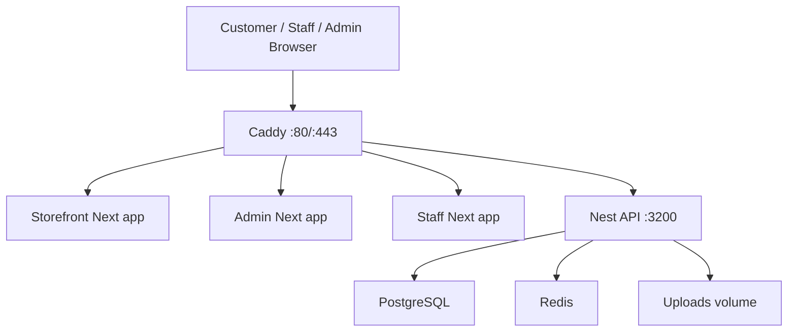

# Tuckinn VPS Clean Upgrade Design

## Goal

Upgrade the live VPS to the current Tuckinn platform release so `tuckinn.com`, `admin.tuckinn.com`, `staff.tuckinn.com`, and `api.tuckinn.com` all run the new branded and verified stack with a controlled rollback path.

## Current Stack

- One VPS
- Docker Compose production stack at [`platform/infra/docker/docker-compose.prod.yml`](C:\Users\steph\OneDrive\Desktop\tuckinn%20p%20new\platform\infra\docker\docker-compose.prod.yml)
- Caddy edge proxy via [`platform/infra/docker/Caddyfile`](C:\Users\steph\OneDrive\Desktop\tuckinn%20p%20new\platform\infra\docker\Caddyfile)
- App services:
  - storefront
  - admin
  - staff
  - api
- Data services:
  - postgres
  - redis
- Existing VPS deploy helper: [`platform/infra/docker/deploy-vps.sh`](C:\Users\steph\OneDrive\Desktop\tuckinn%20p%20new\platform\infra\docker\deploy-vps.sh)

## Deployment Decision

Use a brief planned maintenance window.

This is the correct decision for the current architecture because:

- the stack runs on one VPS, not a blue/green or multi-node topology
- the deploy path rebuilds containers in place
- the database lives on the same host and must remain consistent with the API version
- a fake rolling deployment would increase the chance of mixed app/schema state without giving meaningful operational safety

The target is a clean, auditable release, not deployment theatrics.

## Release Strategy

The upgrade should happen as a controlled sequence:

1. Freeze the release candidate.
2. Verify the candidate locally.
3. Prepare the VPS and production env.
4. Create a database backup and record the current running revision.
5. Put the site into a short maintenance window.
6. Pull code on the VPS.
7. Build and restart the production stack.
8. Run Prisma production migrations before reopening traffic.
9. Run smoke checks across API, storefront, admin, and staff.
10. Reopen traffic only after verification passes.

If any step after backup fails, roll back to the previous revision and restore the previous application stack. Database restore is reserved for migration or data-corruption failure, not routine app rollback.

## Required Upgrade Scope

The clean upgrade must cover all of these pieces together:

- storefront app
- admin app
- staff app
- API app
- Prisma migration state
- production env file
- Caddy edge routing and TLS
- PostgreSQL backup and restore readiness
- Redis connectivity
- uploads volume persistence
- smoke test and rollback procedure

## Gaps In The Current Repo

These are the relevant current-state gaps that the upgrade plan must address:

1. The deploy docs mention a GitHub Actions VPS deploy workflow, but no checked-in workflow currently exists under `.github/workflows`.
2. The current VPS deploy helper does `pull + build + up -d`, but it does not handle:
   - maintenance window coordination
   - pre-deploy backup enforcement
   - Prisma production migration execution
   - smoke-test gating
   - rollback orchestration
3. Production env handling is still file-based on the VPS, which is acceptable for the current size, but it must be treated as the source of truth and never regenerated from local placeholders during the release.
4. First-deploy seeding and normal upgrade behavior must be separated. Running seed on every deployment is not acceptable.

## Production Architecture

## Release Units

### 1. Release Candidate

The release candidate is the current local repository state after:

- storefront branding
- admin branding
- staff board upgrade
- API payment/realtime hardening
- verified local end-to-end order flow

The candidate should be treated as a single platform release, not four unrelated app pushes.

### 2. Runtime Configuration

The VPS must own the live `.env.production` file. It needs final values for:

- domains
- JWT/session secrets
- database credentials
- Stripe live keys
- S3/media credentials
- CORS origins
- seeded admin credentials for first deploy only

The release process must preserve the existing live env file and update it deliberately, never overwrite it blindly from `.env.production.example`.

### 3. Data Safety

Before the upgrade:

- confirm PostgreSQL health
- create a timestamped backup
- confirm the backup file exists and is readable
- record the current Git revision and currently running containers

If a migration is introduced, the rollback decision must explicitly account for database compatibility.

### 4. Application Upgrade

Upgrade order:

1. edge remains up until maintenance starts
2. backup and revision capture
3. maintenance window begins
4. code update on VPS
5. app image rebuild
6. data services remain healthy
7. API upgraded
8. Prisma migrate deploy runs
9. storefront, admin, and staff upgraded
10. Caddy continues routing to healthy containers

### 5. Verification

Minimum smoke checks after deployment:

- `GET /api/health`
- storefront home loads
- admin home loads
- staff home loads
- staff login works
- fulfillment board loads
- public catalog loads

Preferred smoke checks:

- authenticated admin login
- one test order through checkout path in production-safe mode if available
- Stripe webhook endpoint returns valid signature failure for a synthetic invalid request instead of crashing

### 6. Rollback

Rollback must include:

- previous Git revision on the VPS
- exact command to reset checkout to previous revision without destructive git history rewriting
- rebuild/restart previous app version
- smoke checks against previous version
- database restore command only if migration/data state requires it

## Security And Operations Decisions

### Decision: Keep Docker Compose On The VPS For This Release

Accepted.

Reason:

- it matches the current production assets already in repo
- it minimizes change surface during the upgrade
- it is sufficient for current scale

Rejected alternatives:

- Kubernetes now: operationally unjustified
- full blue/green on a single VPS: complexity without enough safety gain

### Decision: Use Manual Or SSH-Automated Release, Not Full CI/CD Cutover First

Accepted.

Reason:

- the repo lacks a checked-in production workflow today
- the first priority is a clean and repeatable release procedure
- automation can be added after the manual path is hardened

The design should still leave room for a later GitHub Actions deploy job that SSHes into the VPS and runs the same verified release script.

## Success Criteria

The upgrade is successful only if all of the following are true:

- all four domains serve the new platform release
- API health is green
- admin login works
- staff login works
- staff board loads
- storefront catalog loads
- no production secret was overwritten by example values
- a fresh backup exists from immediately before deployment
- rollback commands are documented and tested at least to the application-layer restart step

## Risks And Mitigations

- Risk: mixed database and API state
  - Mitigation: backup first, run explicit `prisma migrate deploy`, smoke test before reopening
- Risk: broken env values after pull
  - Mitigation: preserve `.env.production`, diff required keys against example before deploy
- Risk: partial success across subdomains
  - Mitigation: smoke-check each domain separately, not just API
- Risk: silent edge or TLS issue
  - Mitigation: verify Caddy is healthy and test all public domains after restart
- Risk: no reliable rollback path under pressure
  - Mitigation: record previous revision and exact rollback commands before touching the release

## Recommended Next Step

Create a task-by-task execution plan for a maintenance-window release on the existing VPS, including:

- release checklist
- env audit
- backup
- deploy commands
- migration step
- smoke tests
- rollback commands
